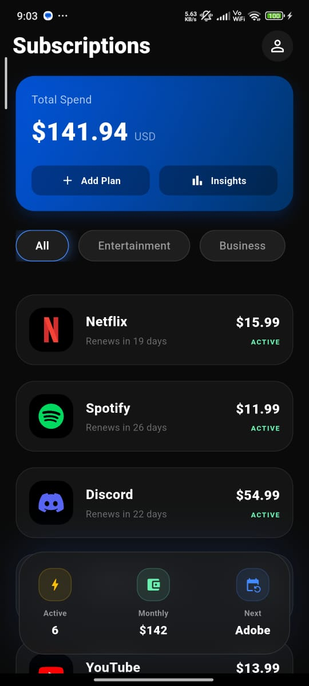

📱 Subscription Management App
A professional, high-performance Flutter application designed for managing digital subscriptions with a modern Glassmorphism UI.

✨ Features
Interactive Dashboard: A dynamic header with a bounce animation and a real-time spending tracker.

Glassmorphism Design: Beautiful, blurred-transparent cards for a premium "Netflix-style" look.

Category Filtering: Seamlessly filter between Entertainment, Business, and Cloud subscriptions using a responsive category selector.

Quick Stats Panel: A floating glass-morphic panel providing immediate insights into active plans and monthly costs.

Clean Architecture: Organized into data and presentation layers for scalability and maintainability.

🛠️ Technical Stack
Framework: Flutter.

Language: Dart.

State Management: Optimized setState for high-performance UI updates.

Architectural Pattern: Feature-first Clean Architecture.

📸 Preview
🚀 How to Run
Clone the repository:

Bash
git clone https://github.com/Ahmed-Elzaher/subscription_management_app.git
Navigate to the project directory:

Bash
cd subscription_management
Install dependencies:

Bash
flutter pub get
Run the app:

Bash
flutter run
👨‍💻 Developer
Ahmed Elzaher - Mobile Application Developer (Flutter). 

